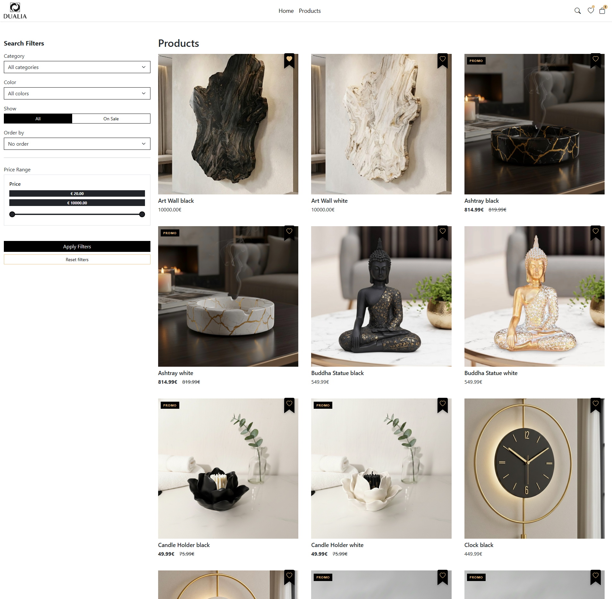
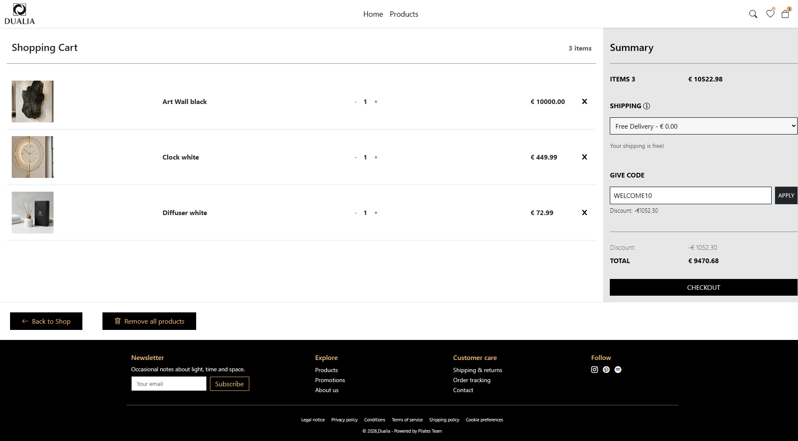
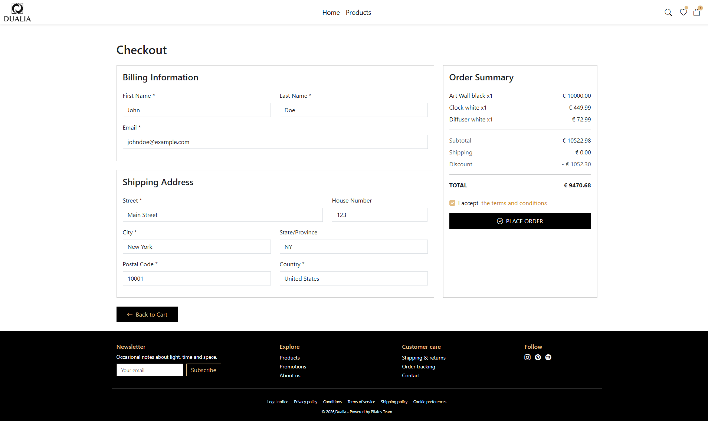
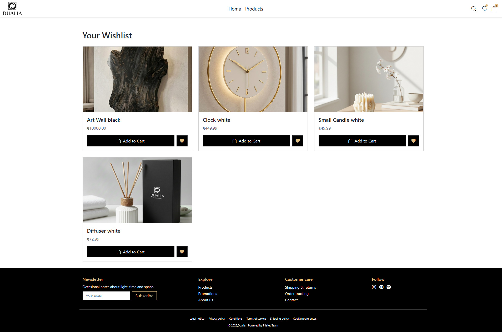
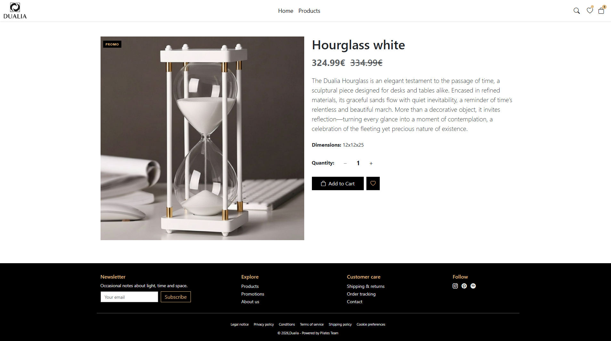
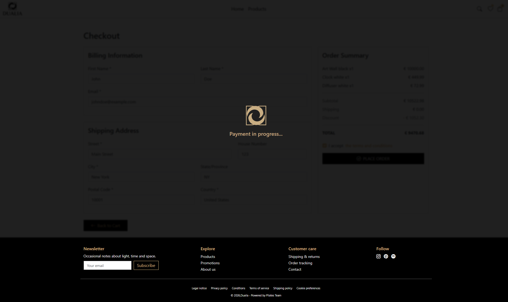
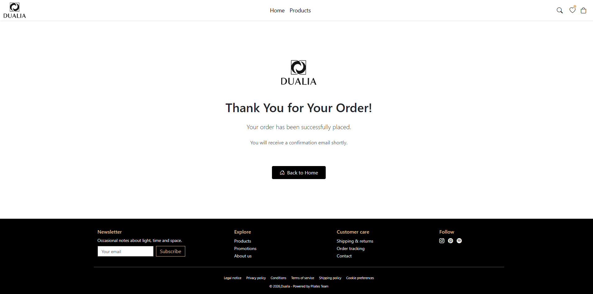
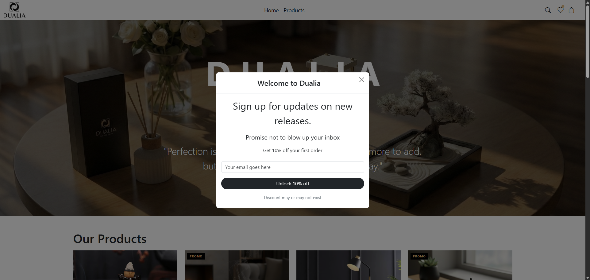
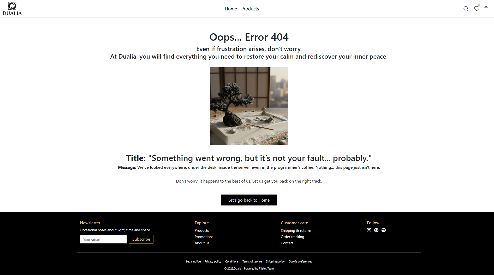

# Dualia - Interior Design E-commerce

Dualia is a sophisticated full-stack e-commerce platform dedicated to minimalist interior design. The project focuses on a "Two colors, One balance" philosophy, offering a curated selection of home decor items like zen gardens, clocks, and ambient lighting.

## Installation

1. Clone the repository:

```bash
git clone <repository-url>
cd dualia
```

2. Install dependencies:

```bash
npm install
```

## Usage

Start the development server:

```bash
npm run dev
```

## Project Architecture

This project is built using a **decoupled architecture** to ensure scalability and clean separation of concerns. The system is divided into two independent units:

- **Frontend (Current Repo):** A responsive Single Page Application (SPA) built with **Vite**, **React**, and **Bootstrap**. It handles the UI/UX, state management for the cart/wishlist, and communicates with the API.
- **Backend (External Repo):** A dedicated server-side application that manages the logic, database (MySQL), and RESTful endpoints.
  - 🔗 **View Backend Repository:** [https://github.com/Michecosa/team-1](https://github.com/Michecosa/team-1)

---

### Folder Structure

```
dualia/
├── src/
│   ├── assets/
│   ├── components/
│   ├── layout/
│   ├── pages/
│   └── App.js
│   └── index.css
│   └── main.jsx
│   └── whishlistUtils.js
├── package.json
⋮
└── README.md
```

## Front-end

- **Responsive Homepage**: Features hero sections, "Our Products" categories, and "Best Sellers".
- **Product Catalog**: Advanced filtering and sorting of home decor items.
- **Wishlist System**: Users can save their favorite items for later.
- **Interactive Shopping Cart**: Real-time updates with discount code support (e.g., `WELCOME10`).
- **Complete Checkout Flow**: Secure multi-step process including billing/shipping info and payment processing simulation.
- **Order Confirmation**: Dynamic "Thank You" page with automated confirmation messaging.

## Back-end

- **RESTful API**: Handles product data, categories, and user orders.
- **User Management**: (If applicable) Authentication and order history.
- **Order Processing**: Validation of shipping details and inventory management.
- **Newsletter Integration**: Functional subscription footer for marketing.

## Visual Overview

|                      Homepage                      |                  Product Catalog                   |
| :------------------------------------------------: | :------------------------------------------------: |
|  |  |

|               Shopping Cart                |                  Checkout Process                  |
| :----------------------------------------: | :------------------------------------------------: |
|  |  |

|                      Wishlist                      |                        Single Product                         |
| :------------------------------------------------: | :-----------------------------------------------------------: |
|  |  |

|                     Payment Loading                     |                    Order Success                    |
| :-----------------------------------------------------: | :-------------------------------------------------: |
|  |  |

|                 Welcome Popup                  |                      Route 404                      |
| :--------------------------------------------: | :-------------------------------------------------: |
|  |  |
